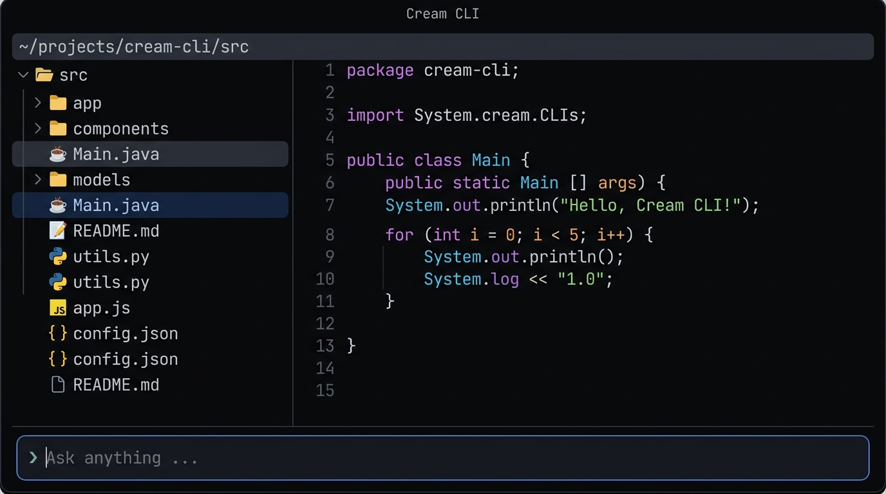

# Cream CLI

> A premium terminal file explorer and editor — built on the [FastJava](https://github.com/andrestubbe/FastJava) ecosystem.

---

## Overview

Cream CLI is a native Windows terminal application that brings a sleek, keyboard-driven workflow to file navigation and code editing — entirely inside your terminal.

Built on top of [FastTUI](https://github.com/andrestubbe/FastTUI), [FastTerminal](https://github.com/andrestubbe/FastTerminal), and [FastFileIndex](https://github.com/andrestubbe/FastFileIndex), it runs at native speed with 24-bit true color rendering.

---

## Features

- **File Explorer** — Navigate your filesystem with emoji file-type icons, smooth scrolling, and instant directory loading
- **Code Editor** — Full caret, selection, clipboard, and syntax highlighting for Java files
- **Split View** — Explorer and editor side by side (`Ctrl+D` to toggle)
- **Fast File Index** — Press `A` to scan your entire drive in the background while the UI stays alive
- **Throttled Repaints** — Locked 16ms render loop during scanning for smooth live feedback
- **Mouse Support** — Click, drag-to-select, and scroll wheel work throughout

---

## Keybindings

| Key | Action |
|---|---|
| `↑` / `↓` | Navigate files / move caret |
| `Enter` | Open file or folder |
| `Backspace` | Navigate up one directory |
| `ESC` | Return to explorer |
| `Ctrl+D` | Toggle split view |
| `Ctrl+A` | Select all (editor) |
| `Ctrl+C` / `X` / `V` | Copy / Cut / Paste |
| `Ctrl+Q` | Quit |
| `A` | Scan full drive (background) |

---

## Part of the Cream Ecosystem

| Project | Description |
|---|---|
| **Cream CLI** | Terminal file explorer and editor |
| Cream GUI *(coming soon)* | Native Windows GUI counterpart |

---

*Part of the [FastJava Ecosystem](https://github.com/andrestubbe/FastJava) — Making the JVM faster.*
