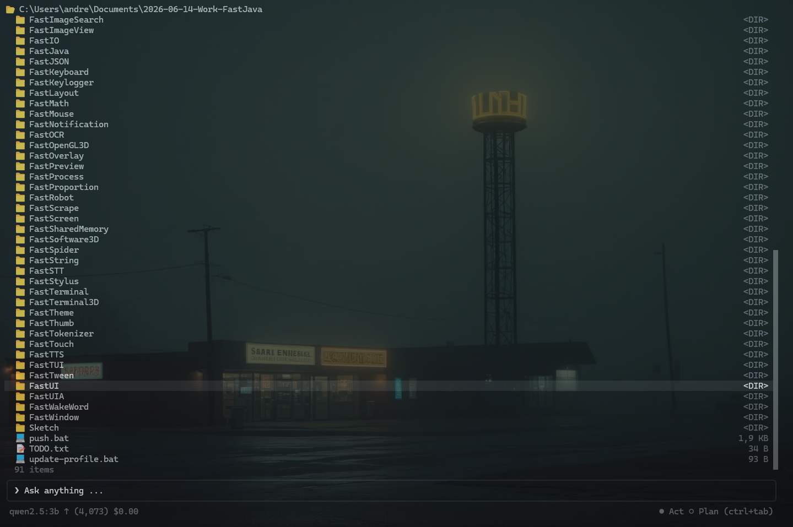

# Cream CLI

> 🚧 **Work in Progress** — active development, expect breaking changes.
>
> A next-generation command-line environment — built on the [FastJava](https://github.com/andrestubbe/FastJava) ecosystem.



<!--

---

## What is Cream CLI?

Cream CLI removes the traditional separation between the terminal, file explorer, and AI.

Instead of treating the terminal as a text-only interface, Cream turns every command into something visible, navigable, and understandable. The command line, filesystem, editor, and AI all operate inside the same interactive workspace.

### Core Ideas

- **No black box.** Every AI action is visible while it happens.
- **Terminal + Explorer become one.** Files are both commands and visual objects.
- **AI works transparently.** You can watch every file being opened, every edit, every command, and every decision.
- **Everything stays interactive.** Nothing disappears behind hidden background processes.

### Philosophy

Traditional AI coding assistants often execute hundreds of invisible operations.

Cream takes the opposite approach.

Instead of asking users to trust the AI, it lets them follow every step in real time.
You don't just receive the result — you watch it happen.

---

## Vision — The Temporal Shell

> *CREAM CLI is the command-line interface for the CREAM system — a time-based file explorer and timeline engine for temporal navigation, week/project timelines, and temporal reconstruction.*

CREAM CLI thinks not in folders but in **moments, time ranges, and project spaces**.

```
cream ls --at 2024-11-03T14:00
cream diff --between 2024-10-01 2024-12-01
cream restore --week 2025-W12
cream enter project FastGPU
cream enter week 2026-W27
cream enter snapshot 2025-03-14T09:22
cream reconstruct project FastJava --at 2025-12-01
cream timeline project FastJava --range 2025-01-01 2026-01-01
```

### Spaces

| Space | Description |
|---|---|
| `WeekSpace` | Navigate your filesystem as it existed in a given week |
| `ProjectSpace` | Scope all operations to a project timeline |
| `TimeSpace` | Query any point in time across all tracked files |
| `SnapshotSpace` | Restore any snapshot with full context |

### Temporal Shell Commands

| Classical | CREAM Equivalent | Meaning |
|---|---|---|
| `cd` | `cdt` | Change directory *in time* |
| `ls` | `lst` | List files *at a point in time* |
| `cp` | `cpt` | Copy *from a past state* |
| `rm` | `rmt` | Remove *at a time* |

---

## Features

- Visual terminal
- Integrated file explorer
- Live filesystem navigation
- AI-controlled editor
- Step-by-step command execution
- Interactive command history
- Real-time file changes
- Unified workspace
- Keyboard-first workflow
- Designed for both humans and AI agents

---

## Built on the FastJava Ecosystem

Cream CLI is assembled from the following FastJava libraries:

| Library | Role |
|---|---|
| [FastTerminal](https://github.com/andrestubbe/FastTerminal) | Native terminal rendering engine |
| [FastTUI](https://github.com/andrestubbe/FastTUI) | Retained-mode UI component framework |
| [FastANSI](https://github.com/andrestubbe/FastANSI) | ANSI escape code utilities |
| [FastASCII](https://github.com/andrestubbe/FastASCII) | ASCII art and font rendering |
| [FastEmojis](https://github.com/andrestubbe/FastEmojis) | Emoji width and rendering support |
| [FastAnimation](https://github.com/andrestubbe/FastAnimation) | Animation and transition engine |
| [FastTween](https://github.com/andrestubbe/FastTween) | Tweening and easing functions |
| [FastKeyboard](https://github.com/andrestubbe/FastKeyboard) | Native keyboard input handling |
| [FastMouse](https://github.com/andrestubbe/FastMouse) | Native mouse input and events |
| [FastClipboard](https://github.com/andrestubbe/FastClipboard) | System clipboard integration |
| [FastString](https://github.com/andrestubbe/FastString) | High-performance string utilities |
| [FastBytes](https://github.com/andrestubbe/FastBytes) | Binary data manipulation |
| [FastIO](https://github.com/andrestubbe/FastIO) | Fast file I/O primitives |
| [FastCore](https://github.com/andrestubbe/FastCore) | Core runtime and shared utilities |
| [FastCompress](https://github.com/andrestubbe/FastCompress) | Compression and decompression |
| [FastGLOB](https://github.com/andrestubbe/FastGLOB) | Glob pattern matching |
| [FastFileIndex](https://github.com/andrestubbe/FastFileIndex) | Native high-speed filesystem indexing |
| [FastFileWatch](https://github.com/andrestubbe/FastFileWatch) | Real-time filesystem change detection |
| [FastFileSearch](https://github.com/andrestubbe/FastFileSearch) | Fast fuzzy file search |
| [FastHardware](https://github.com/andrestubbe/FastHardware) | Hardware capability detection |
| [FastOCR](https://github.com/andrestubbe/FastOCR) | Optical character recognition |
| [FastAI](https://github.com/andrestubbe/FastAI) | AI inference engine |
| [FastAIMemory](https://github.com/andrestubbe/FastAIMemory) | Persistent AI memory layer |
| [FastAIModel](https://github.com/andrestubbe/FastAIModel) | AI model management |
| [FastAIBot](https://github.com/andrestubbe/FastAIBot) | AI bot orchestration |
| [FastAIAgent](https://github.com/andrestubbe/FastAIAgent) | AI agent runtime |
| [FastAIRag](https://github.com/andrestubbe/FastAIRag) | Retrieval-augmented generation |
| [FastAIVectorDB](https://github.com/andrestubbe/FastAIVectorDB) | Vector database for AI memory |
| [FastAudioPlayer](https://github.com/andrestubbe/FastAudioPlayer) | Audio playback |
| [FastAudioCapture](https://github.com/andrestubbe/FastAudioCapture) | Audio capture and recording |
| [FastTTS](https://github.com/andrestubbe/FastTTS) | Text-to-speech synthesis |
| [FastWakeWord](https://github.com/andrestubbe/FastWakeWord) | Wake word detection |

---

## Part of the Cream Ecosystem

| Project | Description |
|---|---|
| **Cream CLI** | Terminal file explorer, temporal shell, and AI workspace |
| Cream GUI *(coming soon)* | Native Windows GUI counterpart |

---

*Part of the [FastJava Ecosystem](https://github.com/andrestubbe/FastJava) — Making the JVM faster.*

-->
